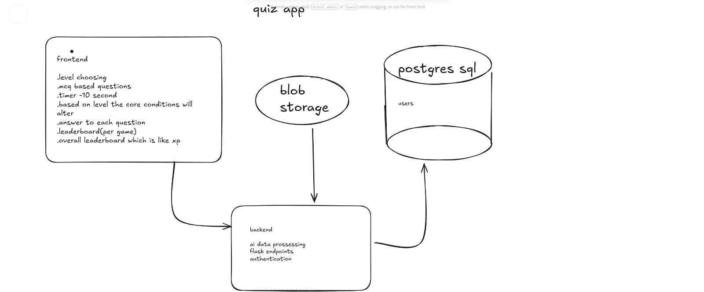

i# Cricket Quiz App 

A dynamic cricket quiz application that generates questions using real-world data from Cricsheet and the generative capabilities of Google's Gemini AI. User authentication and scoring are managed via a PostgreSQL database.

## Features

- **AI-Generated Questions**: Uses Gemini to generate unique and challenging questions (approx. 10 per session) based on raw cricket data.
- **Real Data**: Utilizes authentic match data from [Cricsheet](https://cricsheet.org/).
- **User Authentication**: Secure sign-up and login functionality.
- **Score Tracking**: Persists user scores and history in a PostgreSQL database.
- **Game Mechanics**:
    - **Level Selection**: Choose difficulty levels that alter core game conditions.
    - **Timer**: 10-second timer per question.
    - **Leaderboards**: Per-game leaderboard and overall XP-based ranking.

## Tech Stack

- **Data Source**: [Cricsheet](https://cricsheet.org/) (JSON/YAML match data)
- **AI Engine**: Google Gemini API
- **Database**: PostgreSQL (for Users and Scores)
- **Backend**: Python (Flask)
- **Frontend**: (To be determined)

## Architecture

1. **Frontend**: Handles level choosing, MCQ display, 10s timer, and leaderboards.
2. **Backend (Flask)**: Manages authentication, AI data processing, and API endpoints.
3. **Data Flow**:
    - **Blob Storage** feeds data to the Backend.
    - **Gemini AI** processes data to generate questions.
    - **PostgreSQL** stores user data and scores.

## Database Schema (Proposed)

### `users`
- `id` (Primary Key)
- `username`
- `email`
- `password_hash`
- `created_at`

### `scores`
- `id` (Primary Key)
- `user_id` (Foreign Key)
- `score`
- `total_questions`
- `date_played`

## � Day 1 Progress

### Branch: `main`
- Initialized project repository and structure.
- Defined core architecture, tech stack, and database schema.

### Branch: `meeraaj`
- Refactored `README.md` for better clarity and detail.
- Enhanced descriptions of project features and architectural flow.

### Branch: `mrudu`
- **MCP Server Setup**: Implemented the Model Context Protocol tool (`quiz_mcp_tool.py`) for AI interaction.
- **Gemini Integration**: Built `GeminiService` using the new `google-genai` SDK (migrated from deprecated `google-generativeai`).
- **API Management**: Implemented rate-limit handling (429 errors) and switched to `gemini-2.5-flash` for better performance.
- **Testing**: Added `test_gemini.py` and `list_models.py` to verify API keys and model availability.

## �Setup

*(Instructions to be added as development progresses)*

1. Clone the repository.
2. Set up PostgreSQL database.
3. Configure environment variables (`GEMINI_API_KEY`, `DB_CONNECTION_STRING`).
4. Run the application.

